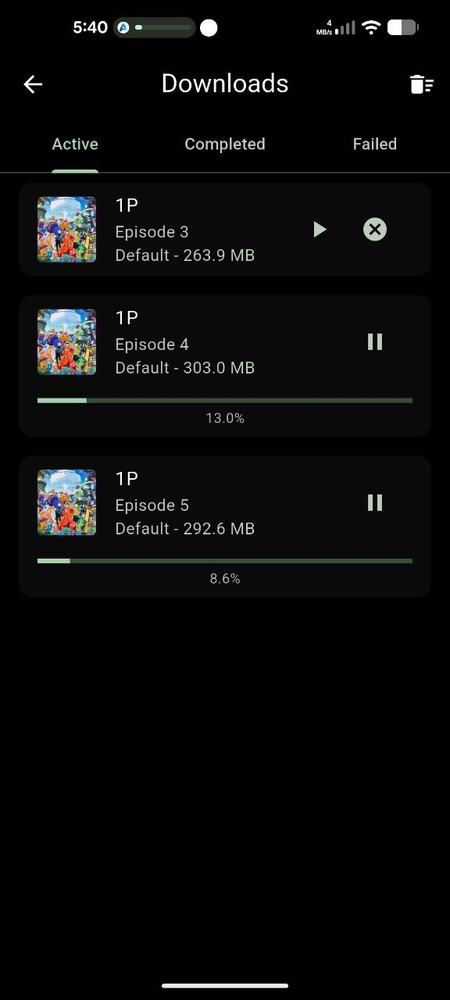
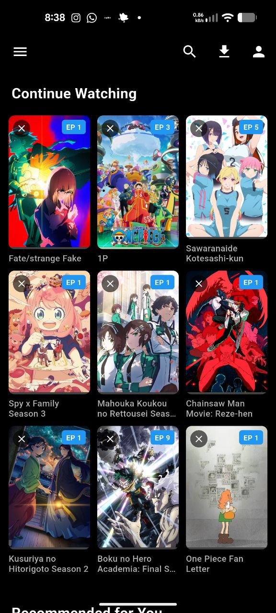
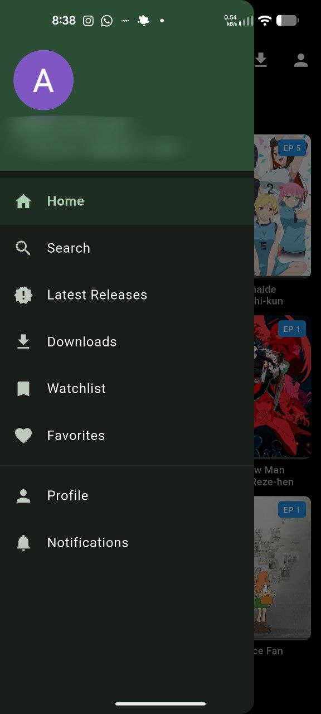
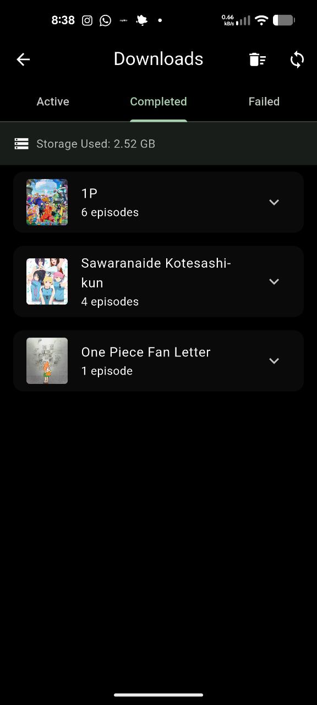
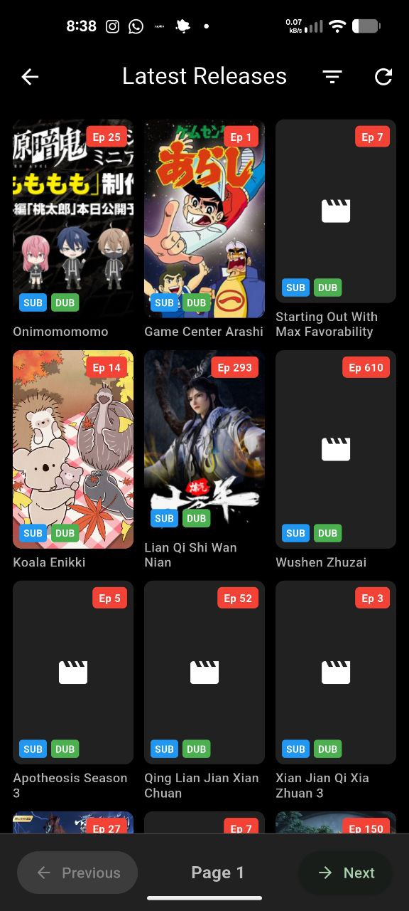
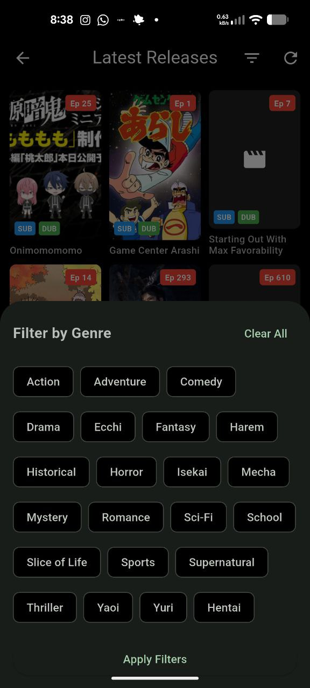
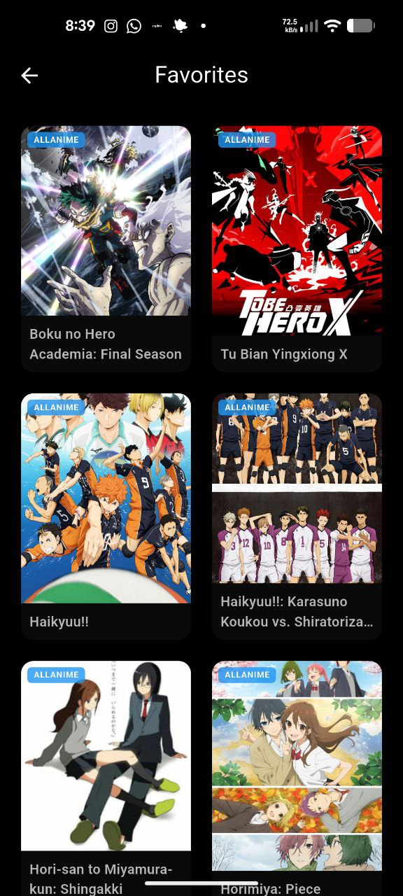
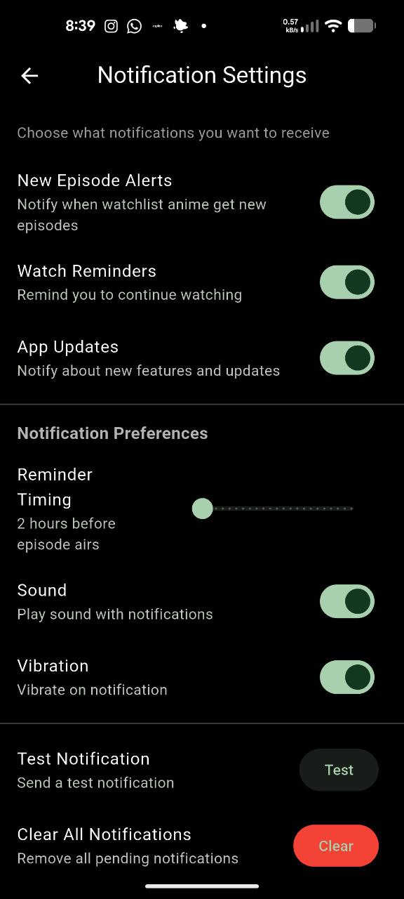
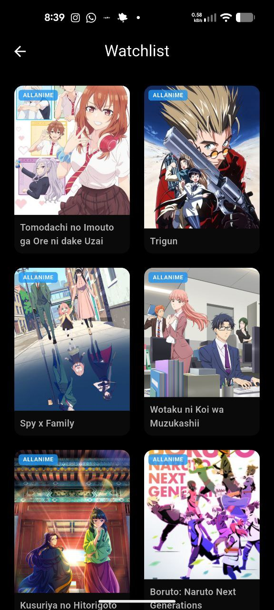

# AniVerse

A cross-platform anime streaming application built with Flutter. Streams anime content from AllAnime using adaptive video players.

## Features

- Browse latest anime releases and search for titles
- Stream episodes with multi-quality support
- Adaptive video player with gesture controls
- Continue watching history with local resume capability
- Watchlist and favorites management
- Google Sign-In for cloud sync
- Cross-platform support (Android, iOS, Web, Linux, Windows)

## Screenshots
<p align="center">
  
  
  
</p>
<p align="center">
  
  
  
</p>
<p align="center">
  
  
  
</p>

## Technical Details

### Video Playback
- Uses media_kit for cross-platform video playback
- Automatic source switching on failure
- Smart error handling to prevent premature failures during buffering
- Supports multiple quality options per episode

### Data Management
- Local storage with Hive for offline capability
- Firebase Authentication for user accounts
- Cloud Firestore for cross-device sync
- Optimized to minimize database writes

## Development Setup

### Prerequisites
- Flutter SDK (3.5.4 or later)
- Firebase project configured
- Android Studio or VS Code

### Dependencies
Main dependencies include:
- flutter_riverpod: State management
- media_kit: Video playback
- firebase_auth: Authentication
- cloud_firestore: Cloud database
- hive: Local storage
- dio: HTTP client

### Build Instructions

Install dependencies:
```bash
flutter pub get
```

Run on Android:
```bash
flutter run
```

Build release APK:
```bash
flutter build apk --release
```

### Firebase Configuration
1. Create a Firebase project
2. Add Android/iOS/Web apps to Firebase
3. Download and place configuration files in the appropriate directories
4. Enable Google Sign-In in Firebase Console

## Known Limitations
- Cross-device resume requires Firebase integration
- Position tracking is local-only to reduce database costs
- Linux builds use external mpv player

## License

> [!NOTE]
> **Built with AI Assistance**
> This application was developed using AI Agents. While functional and rich in features, code structure and logic are the result of AI-human collaboration.
This project is for educational purposes only.
